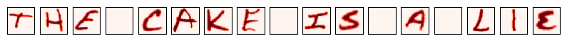
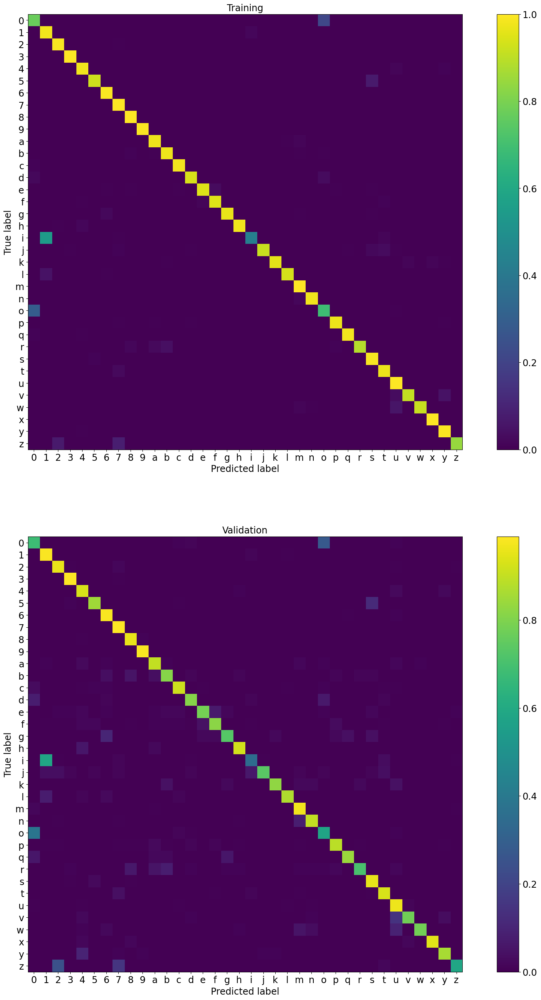

# TensorFlow letters recognition

This code learnes to recognize letters based on [EMNIST](https://biometrics.nist.gov/cs_links/EMNIST/gzip.zip) dataset.

Example text

Decoded text: thejcakfjisjajl1e

Losses

Confusion matricies

